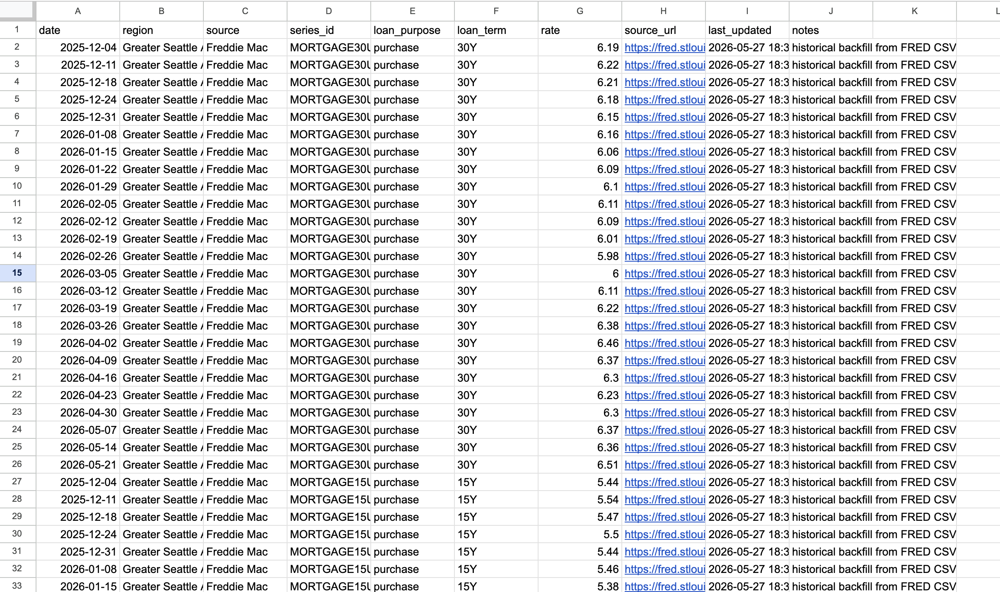
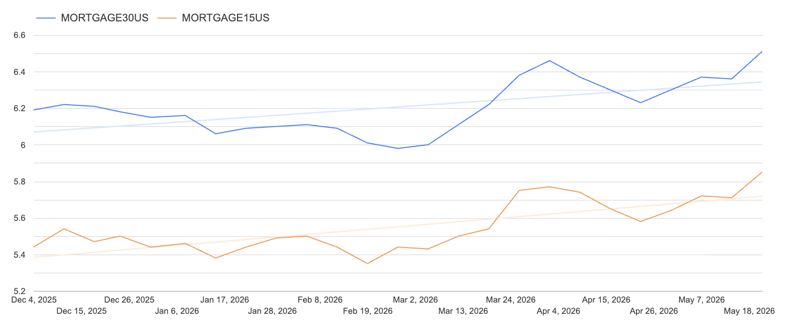
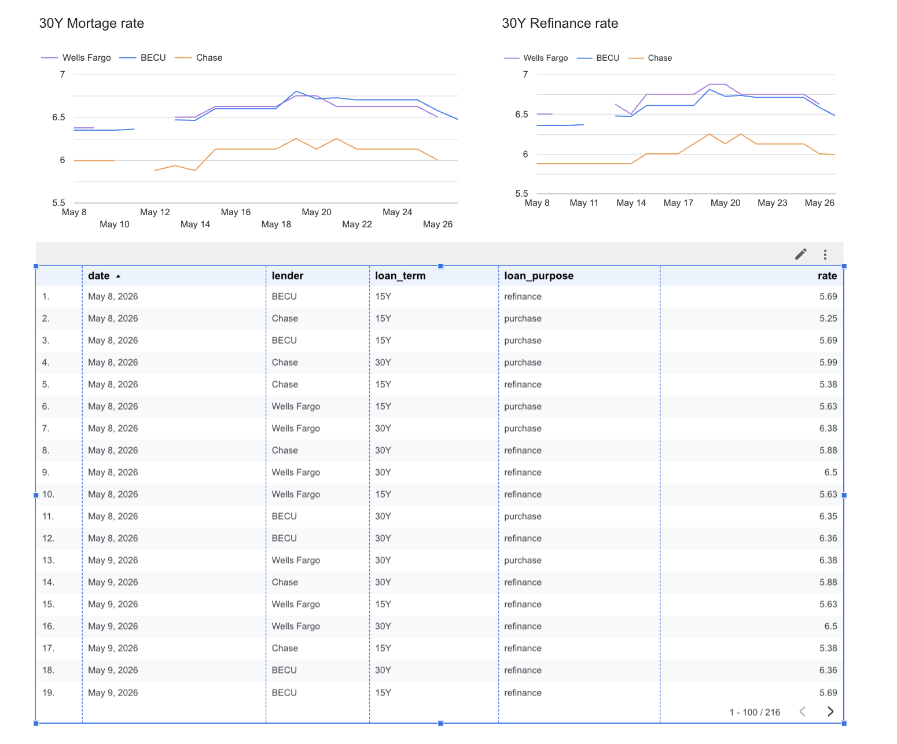

# Mortgage Rate Tracker

An automated mortgage rate tracking pipeline that collects purchase rates from major lenders, normalizes the data into a dashboard-ready schema, and supports historical trend analysis for refinance decision-making.

This project was built as a real-world data automation system rather than a static demo. The goal is to track mortgage rate changes across lenders in the Greater Seattle area and make the data usable for comparison, monitoring, and downstream visualization.

---

## Why I Built This

Mortgage rates vary across lenders, loan terms, and loan purposes. Many lender websites display rates through dynamic pages, interactive forms, or semi-structured HTML, which makes manual tracking inconsistent and time-consuming.

This project automates the collection process and creates a structured dataset that can be used to answer questions such as:

- How do 30-year fixed rates differ across lenders?
- How do purchase rates change over time?
- Which lender is currently offering the most competitive quoted rate?
- When might it be worth considering a refinance?

---

## System Overview

The pipeline is designed as a lightweight ETL workflow:

1. **Extract**
   - Scrape mortgage rate data from lender websites.
   - Use Playwright for dynamic pages that require browser interaction.
   - Use requests and BeautifulSoup for static or semi-structured pages.

2. **Transform**
   - Parse raw webpage text into structured fields.
   - Normalize lender names, loan terms, loan purposes, rates, APRs, points, and source URLs.
   - Add collection metadata such as timestamp, region, confidence score, and raw matched text.

3. **Load**
   - Append cleaned records into a Google Sheets table.
   - Keep a historical record for dashboarding and trend analysis.

4. **Visualize**
   - The output schema is designed to connect to Looker Studio.

---

## Architecture

```text
Lender Websites
   |
   |-- Playwright scraper for dynamic pages
   |-- Requests + BeautifulSoup scraper for static pages
   |
Parsing + Normalization Layer
   |
Structured DataFrame
   |
Google Sheets Storage
   |
Looker Studio Dashboard / Historical Analysis
```
---

## Tech Stack
- Python — core scripting and data processing
- Playwright — browser automation for dynamic mortgage pages
- BeautifulSoup / requests — HTML parsing for static lender pages
- pandas — tabular transformation and schema normalization
- pygsheets — Google Sheets integration
- GitHub Actions — scheduled automation
- Looker Studio — dashboard-ready reporting layer

---

## Demo / Screenshots

### Pipeline Output




### FRED Rate Backfill Output

This screenshot shows the historical mortgage rate backfill output used to seed the tracker with baseline market data.



### Mortgage Rate Dashboard Preview

This screenshot shows the dashboard-ready rate tracking view for lender comparison and trend analysis.



## Future Improvements
Add retry and fallback logic for failed lender pages
Add data quality checks before appending rows
Add alerting when rates change beyond a configured threshold
Add more lender sources
Move parsing rules into a configuration layer
Add unit tests for parser functions
Add a small dashboard screenshot or sample Looker Studio view
Add CI validation for scraper output schema